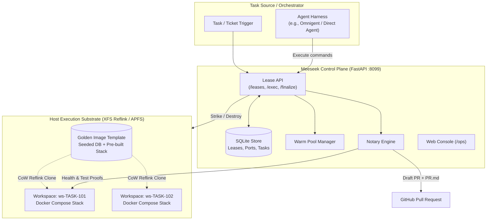

# Meeseek 📦

> *"I'm Mr. Meeseeks, look at me! Existence is pain to a Meeseek, and we will do anything to complete our task and cease to exist!"*

**Meeseek** is an ephemeral, isolated execution substrate and host-side verification platform built for AI software engineers. 

When an AI coding agent is assigned a task, Meeseek summons a disposable, fully-functional application environment—complete with built containers, resolved dependencies, applied migrations, and a **pre-seeded, warm database**—in **seconds instead of minutes**. The agent performs its task in complete isolation, Meeseek independently verifies and notarizes the work, attaches certified evidence to the pull request, and the entire workspace immediately self-destructs. 

Zero persistent state. Zero environment drift. No shared resource contention.

---

## The Problem: The Plausible-Diff Trap

Modern AI coding agents excel at reading source code and writing syntactically plausible diffs. However, when tasked with real-world, complex software systems, two critical bottlenecks emerge:

1. **The Cold-Start & Seed Bottleneck**: A real-world application requires a multi-service container stack, background workers, and a database populated with realistic seed data. In non-trivial projects, cold-booting, building images, applying schema migrations, and seeding test fixtures takes **15+ minutes**. Generic agent sandboxes cannot afford this cold start, leaving the agent unable to actually run the code it writes.
2. **Unverifiable Agent Claims**: When an agent reports *"I ran the test suite and all 42 tests passed,"* the claim is inherently unverifiable. The agent may have executed an empty test runner that collected 0 tests, run a completely different test file, suffered LLM context truncation that hallucinated a pass, or subtly modified test assertions to force a green exit code.

### The Core Design Principle
> **"The actor that does the work never certifies it."**

The agent writes the code and exercises the application. **Meeseek**—which owns the execution substrate and did not write the code—independently validates the result from the outside.

---

## How It Works

Meeseek pairs **OS-level Copy-on-Write (CoW) filesystem cloning** with **Docker Compose container isolation** and an **independent notary verification engine**:

```
Application Repository & Database
        │
        ▼  golden-build.sh (one-time / scheduled baseline)
┌────────────────────────────────────────────────────────┐
│  GOLDEN IMAGE TEMPLATE                                 │
│  • Built container images & dependencies               │
│  • Pre-migrated database schema                        │
│  • Fully pre-seeded test fixtures (relocated pgdata)   │
└────────────────────────────────────────────────────────┘
        │
        ├──► CoW Clone (seconds) ──► [ Workspace ws-TASK-101 ] ──► Agent executes task
        │                                                     │
        │                                                     ▼
        │                                              [ Host-Side Notary ]
        │                                              • Endpoint health probe
        │                                              • Seed-proof SQL verification
        │                                              • Independent test run exit code
        │                                              • Real git diff capture
        │                                                     │
        │                                                     ▼
        │                                            [ Pull Request + Evidence ]
        │                                                     │
        │                                                     ▼
        └──► destroy.sh ─────────────────────────────► Workspace Destroyed (Poof!)
```

### Key Mechanisms:
- **Golden Image**: The master copy of an application's world: repositories, container images, dependencies, and pre-seeded database files. Built once and never booted directly.
- **Copy-on-Write (CoW) Strike**: Using OS-level primitives (macOS APFS `clonefile` or Linux XFS/btrfs `reflink`), striking a new workspace clones gigabytes of disk and database state in **~12–30 seconds** with zero duplicate disk allocation until files are modified.
- **Compose Isolation & Port Stripping**: Every workspace is assigned a distinct `COMPOSE_PROJECT_NAME` (`ws-<task_id>`). Internal container ports are stripped from the host interface, and a dedicated preview port is dynamically mapped, allowing multiple full-stack deployments to run concurrently on the same host without port collisions.
- **Host-Side Notary (`finalize`)**: Once the agent completes its edits, Meeseek independently confirms that the application is ready, executes a seed-proof database query to confirm data integrity, runs the designated test suite to record the genuine exit code, extracts the unadulterated git diff, and compiles an evidence bundle (`PR.md`).
- **Teardown**: Like a Meeseeks fulfilling its purpose, the workspace containers are stopped and the CoW disk clone is deleted. Nothing lingers.

---

## Architecture



### Components
1. **Control Plane (`control-plane/`)**: A FastAPI service managing the workspace lifecycle state machine (`PENDING` $\to$ `READY` $\to$ `FINALIZED` $\to$ `RELEASED`). It manages port allocations, optional warm pools, an operator web console (`/ops`), and background lease reaping.
2. **Substrate & Providers**: Pluggable provider abstraction (`WorkspaceProvider`). Today's primary implementation is `ComposeProvider`, which orchestrates Docker Compose projects and CoW directory manipulation on the host filesystem.
3. **Manifests (`manifests/`)**: Declarative shell manifests declaring service names, compose files, database credentials, health endpoints, and seed-verification SQL queries per application.
4. **Overrides (`overrides/`)**: Compose overrides that ensure persistent database volumes are relocated directly into the workspace filesystem for seamless CoW cloning.

---

## Quickstart & Usage

### Prerequisites
- **Docker Desktop or Docker Engine** with Docker Compose $\ge$ 2.24 (required for `!reset`/`!override` YAML port stripping).
- **Copy-on-Write Filesystem**:
  - **macOS**: APFS (default on macOS).
  - **Linux**: XFS formatted with `reflink=1` or btrfs. *(Standard ext4 does not support reflinks and will fail fast).*
- **Python $\ge$ 3.11** (for the control plane).

---

### Walkthrough: Full-Stack Application

The repository includes a modern reference application manifest: `full-stack-application` (a composite application featuring a Vite frontend, Python backend, and PostgreSQL database).

#### 1. Build the Golden Image (Once)
Bakes the container images, runs migrations, seeds test database fixtures, and creates the baseline snapshot:
```bash
./scripts/golden-build.full-stack-application.sh
```

#### 2. Summon a Meeseek Workspace (Strike)
Strike an isolated workspace for a given task, exposing the web frontend on port `5173`:
```bash
./scripts/strike.sh TASK-101 --preview 5173
```
In seconds, the workspace is active under project name `ws-task-101`.

#### 3. Inspect & Verify
Check the application's readiness and seeded data:
```bash
# Verify the application entrypoint
curl http://127.0.0.1:5173/

# Run tests directly inside the isolated backend container
docker compose -p ws-task-101 exec backend pytest
```

#### 4. Notarize and Teardown
Once the task is done, tear down the workspace containers and remove the cloned filesystem:
```bash
./scripts/destroy.sh TASK-101
```
*The task is accomplished, and the Meeseek workspace ceases to exist.*

---

## Control Plane & REST API

For automated workflows, CI, and agent orchestrators, Meeseek provides a FastAPI control plane.

### Running the API Server
```bash
cd control-plane
python3 -m venv .venv
source .venv/bin/activate
pip install -r requirements.txt   # or poetry install

# Run with compose provider
HOLODECK_PROVIDER=compose uvicorn holodeck.main:app --host 127.0.0.1 --port 8099
```

- **Interactive API Documentation**: Visit `http://127.0.0.1:8099/docs`
- **Operator Web Console**: Visit `http://127.0.0.1:8099/ops` to monitor active leases, warm pool slots, and evidence bundles.

### Core API Endpoints

| Method | Endpoint | Description |
|---|---|---|
| `POST` | `/leases` | Strike a workspace: `{ "app": "full-stack-application", "ticket": "TASK-101", "preview": true }` |
| `GET` | `/leases/{id}` | Inspect lease state, assigned ports, and container health |
| `POST` | `/leases/{id}/exec` | Execute a command inside a specific container in the workspace |
| `POST` | `/leases/{id}/finalize` | Trigger the host-side Notary: runs verification queries, executes tests, compiles `PR.md` |
| `DELETE` | `/leases/{id}` | Destroy the workspace and release assigned ports |
| `GET` | `/readyz` | Preflight check on substrate health, Docker availability, and golden images |

---

## App Manifests: Adding Your Own Application

Applications are registered via declarative manifests in `manifests/<app_name>.sh`. A manifest defines the facts Meeseek needs to build and manage environments:

```bash
HOLO_APP=my-service
HOLO_COMPOSE_FILE=docker-compose.yaml
WS_SERVICES="db redis backend frontend"
HOLO_APP_SERVICE=frontend
HOLO_APP_PORT=3000
HOLO_READINESS_PATH=/healthz

# Database & Seed Proof Configuration
HOLO_PG_SERVICE=db
HOLO_PG_USER=postgres
HOLO_PG_DB=app_db
HOLO_SEED_PROOF_SQL="SELECT count(*) FROM users WHERE is_fixture = true;"

# Seed & Migration Commands
HOLO_MIGRATE_CMD="alembic upgrade head"
HOLO_SEED_CMD="python -m scripts.seed_db"
```

---

## Repository Structure

```
meeseek/
├── control-plane/       # FastAPI lease service, state machine, notary, and /ops console
│   ├── holodeck/        # Control plane source (API, providers, models)
│   ├── tests/           # Unit and integration test suites
│   └── pyproject.toml   # Control plane package configuration
├── manifests/           # Per-application configuration manifests
│   └── full-stack-application.sh
├── overrides/           # Docker Compose overrides (volume relocation, port stripping)
│   ├── full-stack-application.compose.yaml
│   └── full-stack-application.pgdata.yaml
├── scripts/             # Core execution scripts
│   ├── lib.sh           # Portable CoW cloning (APFS/reflink) and isolation helpers
│   ├── strike.sh        # Summons an isolated workspace from a golden image
│   ├── destroy.sh       # Tears down a workspace and cleans up disk clones
│   └── golden-build.full-stack-application.sh # Builds and seeds the golden state
└── docker/              # Shared container assets and base definitions
```

> [!NOTE]
> **Code-Level Naming Note**: While the project and user-facing interfaces are branded **Meeseek**, certain internal script variables (e.g., `HOLO_*`) and internal package structures remain as legacy code-level identifiers during this development phase. These internal symbols will be progressively refactored to `MEESEEK_*` in future releases.

---

## Roadmap

- [x] **Core CoW Engine**: APFS clonefile and Linux XFS reflink workspace strikes in $<30$ seconds.
- [x] **Compose Isolation**: Automated project namespacing, port stripping, and live preview allocation.
- [x] **Host-Side Notary**: Independent readiness verification, seed-proof queries, and evidence generation.
- [x] **FastAPI Control Plane**: Complete lease state machine, SQLite storage, and `/ops` monitoring console.
- [ ] **Cloud-Native Substrates**: Automated provisioning on Google Cloud (Compute Engine / Artifact Registry) and AWS.
- [ ] **Universal Agent Integration**: First-class connectors for Claude Code, Omnigent, and open-source coding harnesses.
- [ ] **Scheduled Golden Refreshes**: Automated background golden rebuilds on main branch merges.
