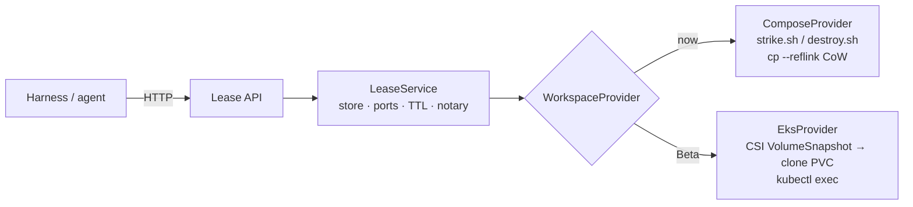

# Holodeck Control Plane — Thin Lease API (Track B)

A thin HTTP service that wraps the **proven `scripts/strike.sh` / `scripts/destroy.sh`
CoW mechanism** so a harness (an agent, CI, a PR-preview trigger) calls an API instead
of a human running shell. The mechanism does not change — this is glue drawn so the
*same* API promotes from EC2 (Docker Compose) to EKS (Kubernetes) without a rewrite.

Fills the `control-plane/` slot the repo README already reserves ("Beta — FastAPI lease
service"). FastAPI's auto-generated OpenAPI (`/docs`) is the authoritative contract (C9).

## Run it

```bash
cd control-plane
poetry install
# provider=compose shells the repo scripts; box config comes from ../holodeck.local.env
HOLODECK_PROVIDER=compose HOLODECK_TOKEN=$(openssl rand -hex 16) poetry run holodeck-api
poetry run pytest        # 100+ tests, no Docker (FakeProvider)
```

Binds `127.0.0.1:8099` by default. `GET /healthz` reports the active provider.

**Console:** **http://127.0.0.1:8099/ops** — the operator view (environments · live workspaces ·
evidence). The agent run/task board is at `/console`.

No Poetry on the box? A plain venv is the fastest way to see it (`pip` isn't a bare command here —
use `python3 -m pip`; `--index-url` dodges the CodeArtifact 401s):

```bash
cd control-plane
python3 -m venv .venv
.venv/bin/python -m pip install --index-url https://pypi.org/simple fastapi uvicorn pydantic
HOLODECK_PROVIDER=fake .venv/bin/python -m holodeck.main   # in-memory sample data, no Docker
# real data: HOLODECK_PROVIDER=compose (needs Docker + a built golden)
```

## REST contract

| Method | Path | Body → Returns | Notes |
|---|---|---|---|
| `POST` | `/leases` | `{app, ticket, preview?, ttl_s?}` → lease | runs `strike.sh`; API allocates the port |
| `GET` | `/leases/{id}` | → lease state + handle | |
| `POST` | `/leases/{id}/finalize` | **(no body)** → evidence | the notary; re-derives everything host-side. With `HOLODECK_PR=1` also pushes `agent/<id>` + opens a **draft PR** (evidence as the body) → `pr_url`. Guarded off by default |
| `POST` | `/leases/{id}/extend` | `{ttl_s}` → lease | bumps TTL |
| `DELETE` | `/leases/{id}` | → lease (released) | runs `destroy.sh`; frees the port |
| `PUT` | `/leases/{id}/files?path=&service=` | raw bytes body → `204` | copies a file into the workspace (`docker compose cp`) — the harness `put()` primitive |
| `GET` | `/readyz` | → `{ready, provider, problems[]}` (`503` if not ready) | substrate preflight (scripts/docker/golden) — the harness `prepare()` primitive |
| `GET` | `/capabilities` | → `{provider, file_copy, streaming_exec, …}` | what the substrate supports — maps to the harness capability set |
| `POST` | `/leases/{id}/exec` | `{cmd, service?, workdir?, timeout_s?}` → `{exit_code, stdout, stderr}` | scoped `docker compose -p ws-<id> exec -T`; `cmd` is argv or a shlex-split string |
| `WS` | `/leases/{id}/exec` | send `{cmd, service?, workdir?}` → stream `{channel:stdout\|stderr, data}` … then `{channel:exit, code}` | the deck's **exec gateway** (`exec_url`); authed by the **per-lease token**, not the shared token |
| `GET` | `/healthz` | → `{status, provider, active_leases, max_leases}` | unauthenticated |

Status codes: `409` ticket→id collision **or** exec on a non-ready lease · `422` bad/unknown app or ticket · `503` at capacity · `502` substrate failure.

## The `WorkspaceProvider` seam

The API **never calls `strike.sh` directly** — it calls the provider protocol
(`holodeck/providers/base.py`). `strike.sh` is just the Compose implementation of it.
Enforce this in review: the moment one endpoint shells out on its own, EKS becomes a
rewrite instead of a new class.



| Provider | acquire | finalize re-derivation | release | Substrate |
|---|---|---|---|---|
| `ComposeProvider` (EC2) | shells `strike.sh` | `docker compose exec` | shells `destroy.sh` | Compose, `cp --reflink` |
| `EksProvider` (Beta) | Pod/Job from a **PVC snapshot** | `kubectl exec` | delete ns/Job + PVC | K8s + EBS/CSI snapshots |

The REST contract, lease store, reaper, finalize, and auth are provider-agnostic —
written once. Only the ~5 provider methods differ.

## Four confirmed decisions (the *why*, for whoever inherits this)

1. **Stack + location** — `control-plane/` · FastAPI · Python 3.12 · Poetry. Matches
   compliance-backend so `jr`/CI patterns transfer, and fills the README's planned slot.
2. **Finalize test source — structural, not policy.** `finalize` has **no command field**.
   The test comes from `HOLO_TEST_CMD` (manifest), optionally a ticket-derived value
   recorded on the lease at *acquire* time. An agent physically cannot supply a command:
   an absent field is a property; an allowlist is a rule someone relaxes.
3. **Scoped exec over the seam — two shapes, one per-lease capability.** `POST /exec` is
   the one-shot (Omnigent's `run()` shape: exit/stdout/stderr). `WS /exec` is the deck's
   **exec gateway** — acquire returns `exec_url` + a **per-lease token**; connecting the
   WebSocket with that token streams output live. The token is a *capability for that one
   lease*, so `exec_url`+token can be handed to an agent without giving it the shared admin
   token. Both go through `provider.{exec,stream_exec}`, never a direct shell-out, so EKS
   (`kubectl exec`) drops in unchanged. (Line-streamed, not a full interactive PTY —
   stdin/resize is a later add if an interactive TTY is needed.)
4. **`HOLODECK_PROVIDER` switch** — `compose` | `fake` | `eks`. **Fails fast at startup**
   on an unknown value, and the active provider shows in `/healthz` so a demo can flip
   `compose`→`eks` against the same client.

## Hardening (from the pre-code review)

- **#1 Untrusted input → shell.** `app` is allowlisted from `manifests/*.sh` **on disk**
  (never a static list); `ticket` must match `^[A-Za-z0-9][A-Za-z0-9._-]{0,63}$`. Every
  subprocess is an **argv list, `shell=False`**, curated env — never a shell string.
- **#2 Sudo surface.** `destroy.sh` → `sudo rm -rf`, so bind **127.0.0.1 only** and add a
  **shared-token** header (Phase 2). Narrow sudoers to specific binaries, never `ALL`.
- **#3 Port TOCTOU + single worker.** The port is **reserved in the store before** strike
  and held to release (`strike.sh` doesn't check ports, V13). In-memory store ⇒ **`--workers 1`**
  (asserted in `main.py`); `--workers 2` double-allocates ports and hides leases.
- **#4 Restart reconcile.** On startup, orphaned `ws-*` dirs are **logged loudly + their
  ports reserved** (default), or reaped with `HOLODECK_RECONCILE=reap`. We do not fabricate
  a TTL for adopted orphans.
- **#5 Diff base.** `git diff <golden_head>..HEAD` — the total change vs the struck snapshot.
- **#6 Finalize timeout.** Hard wall-clock cap; a hung test records `test_timed_out: true`
  instead of hanging the request. Re-call **overwrites** with fresh truth.
- **#8 Capacity guard.** `MAX_CONCURRENT_LEASES` → `503` (~890 MB/ws ⇒ ~60 per 64 GB host).

## Scaling to 10K

The **design** scales; the **demo implementation** intentionally caps at ~60 on one box:

| Layer | 10K-ready? | Swap point |
|---|---|---|
| REST API (async FastAPI) | yes | stateless |
| `WorkspaceProvider` seam | yes | its whole purpose |
| In-memory store | **no** (process-local, `--workers 1`) | → Postgres/Redis unlocks multi-replica |
| `ComposeProvider` (one box) | **no** (~60/host) | → `EksProvider` spreads across a node pool |
| Same-host exec | **no** | → `kubectl exec` |

Path to 10K, all behind seams built now: external store + `EksProvider` (CSI snapshot
clones, K8s as scheduler) + event-driven health (K8s watch, not polling). EKS also
sidesteps the uid-999 pgdata copy (V1/D2): a `VolumeSnapshot` carries the volume as-is —
the block-level equivalent of `cp --reflink`, no per-file copy. (Caveat: the pod still
needs the right `fsGroup`/`securityContext` for Postgres to start.)

## Layout

```
control-plane/
  holodeck/
    api.py         routes (provider-agnostic)
    service.py     lease lifecycle · ports · capacity · TTL · test-source policy
    store.py       in-memory LeaseStore + PortPool   (⚠ single worker)
    models.py      dataclasses + validation + holo_id (mirrors lib.sh)
    schemas.py     Pydantic I/O (no test-command field, by design)
    config.py      env config + on-disk app allowlist
    factory.py     wiring + startup reconcile
    reaper.py      TTL sweep
    main.py        entrypoint: single-worker + loopback + reconcile
    providers/     base.py (protocol) · compose.py · fake.py
  tests/           30 tests over the FakeProvider (no Docker)
```
